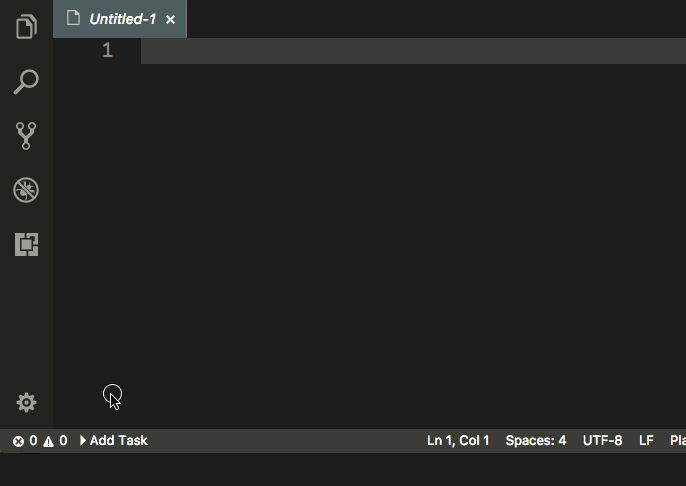

# Timeit README

Simple and easy to use task timer for small task / work inside VScode. 

## Features

* `Create new Task`
* `Stop / Pause Timer`
* `Add more time`
* `Show completion time when task is done`
* `Add more time`

## Configuration

* __timeit.duration__, timer duration on individual task

* __timeit.extratime__, added extra time while task is in progress. 

## Acknowledgement

Icons made by <a href="https://www.flaticon.com/authors/smashicons" title="Smashicons">Smashicons</a> from <a href="https://www.flaticon.com/" title="Flaticon">www.flaticon.com</a> is licensed by <a href="http://creativecommons.org/licenses/by/3.0/" title="Creative Commons BY 3.0" target="_blank">CC 3.0 BY</a>

-----------------------------------------------------------------------------------------------------------

